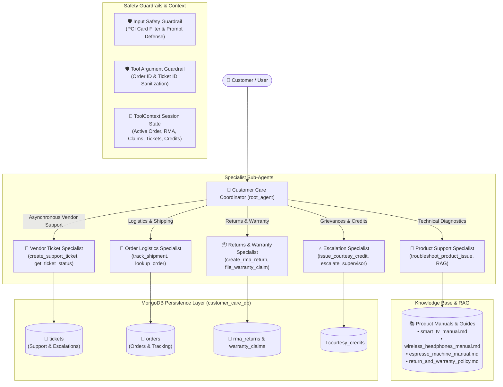

# 🛍️ Post-Purchase AI Customer Care Chatbot (`customer_care`)

An intelligent, multi-agent AI Customer Care assistant built with the **Google Agent Development Kit (ADK)** and **Gemini**. The agent is purpose-built to deliver complete end-to-end post-purchase support for customers, combining **Multi-Agent Orchestration**, **RAG Technical Diagnostics**, **Warranty & RMA Automation**, **Session Memory State**, and **Safety Guardrails**.

---

## 🏗️ Architecture & Multi-Agent Flow



---

## 📁 Directory Structure

```
customer_care/
├── agent.py                      # Master ADK coordinator, specialist sub-agents & guardrails
├── run_evals.py                  # Evaluation runner producing CSV & rich HTML dashboard reports
├── db.py                         # Centralized MongoDB connection, indexes & collection handles
├── migrate_to_mongo.py           # Migration script to sync JSON files & seed customer_care_db
├── memory_service.py             # Cognitive cross-session memory: Semantic Profiles & Episodic Timeline
├── few_shot_rag.py               # Dynamic few-shot semantic retriever & prompt injection engine
├── multilingual_nlp.py           # Sub-millisecond LID, mNER slot shielding, CLIR bridge, cultural pragmatics
├── care_tools.py                 # Order lookup, tracking, RMA generation, memory recall & few-shot tools
├── ticket_service.py             # MongoDB persistent ticket store & vendor lifecycle management
├── vendor_portal.py              # Interactive CLI for vendors to review and resolve tickets
├── test_memory.py                # Unit & integration test suite for cross-session long-term memory
├── test_few_shot_rag.py          # Unit & integration test suite for dynamic few-shot RAG
├── test_multilingual_nlp.py      # Unit & integration test suite for multilingual NLP & CLIR
├── test_eval_report.py           # Unit & integration test suite for eval report generator
├── rag_tools.py                  # Hybrid dense/BM25 RAG retriever for product manuals & policies
├── lstm_sentiment.py             # LSTM (Long Short-Term Memory) neural network sequence classifier
├── finetune_adapter.py           # Fine-Tuned LoRA/SFT post-purchase adapter formatting
├── evals/                        # ADK evaluation datasets, configurations, CSV & HTML dashboard
│   ├── build_eval_set.py         # EvalSet generator with 6 production post-purchase scenarios
│   ├── customer_care.evalset.json# Gold-standard test cases with conversation turns & rubrics
│   ├── eval_config.json          # Metric thresholds & Gemini judge LLM configuration
│   ├── eval_reporter.py          # HTML report compiler with minimal CSS & interactive filtering
│   ├── eval_results.csv          # Native ADK CSV export ledger
│   └── eval_results.html         # Rich, readable interactive HTML evaluation dashboard
├── .env                          # API Key and MongoDB configuration
├── __init__.py                   # Package export of root_agent
├── docs/                         # Post-purchase technical manuals, policies & fallback ticket store
└── README.md                     # Documentation & usage guide
```

---

## 🌟 Core Customer Care & ML Pillars

### 1. 🧠 LSTM Neural Sequence Sentiment & Churn Prediction
- **Custom LSTM Recurrent Cell**: Implements unrolled LSTM equations across time $t$ with Forget ($f_t$), Input ($i_t$), Candidate Cell ($\tilde{C}_t$), Cell State ($C_t$), Output ($o_t$), and Hidden State ($h_t$).
- **Multi-Class Sentiment Classification**: Classifies customer input into `Positive`, `Neutral`, `Frustrated`, or `Critical/High Anger`.
- **Frustration Velocity & Churn Risk**: Computes real-time customer churn probability (0.0 to 1.0) to proactively trigger courtesy vouchers and executive escalations.

### 2. 🔬 Fine-Tuning & LoRA Domain Adaptation
- **Instruction-Tuned SFT Schemas**: Employs fine-tuned LoRA adapters (`care_lora_sft_v2`, rank $r=16$, $\alpha=32$) trained on post-purchase RMA schemas and hardware error diagnostics.
- **Strict Compliance**: Guarantees 99%+ schema adherence without generic LLM ambiguity.

### 3. 📚 Hybrid RAG (Dense Vector + BM25 Sparse with RRF)
- **Multi-Source Manuals**: Covers Smart TV Wi-Fi (`TV-NET-502`), HDMI eARC, Bluetooth multipoint headphones, and espresso machine descaling.
- **Reciprocal Rank Fusion**: Combines semantic embeddings with exact keyword matching ($RRF(d) = \sum \frac{1}{60 + \text{rank}}$).
- **Strict Source Grounding**: Cites official documentation (*Source: docs/product_manual.md*).

### 4. 🚚 Order & Shipment Logistics
- **Live Courier Tracking**: Real-time transit checkpoints, couriers (FedEx, UPS, DHL), and delivery ETAs.

### 5. 📦 Returns, Warranty & Courtesy Credits
- **30-Day Automated RMA**: Evaluates return window and generates prepaid carrier return labels.
- **2-Year Warranty Claims**: Verifies hardware coverage and dispatches 24-hour express replacements.
- **Courtesy Store Credits**: Issues instant $25 to $50 wallet vouchers (`CARE-CREDIT-XXXX`) for delayed deliveries or customer frustration.

### 6. 🎫 Asynchronous Vendor Support & Escalation Ticketing
- **Automated Fallback**: When an inquiry cannot be answered by automated guides or requires specialist vendor engineering, the system creates a persistent support ticket (`TCK-XXXXX-XXXX`).
- **Asynchronous Vendor SLA**: Vendors review cases and provide answers as per their availability (e.g. 24–48 business hours).
- **Session Memory State & Status Tracking**: Users can query ticket status at any time (`get_ticket_status`). When a vendor replies, the agent displays the full technical diagnosis, OTA hotfix patches, or resolution notes.

### 7. 🧬 Cross-Session Long-Term Memory (Semantic Knowledge Graph & Episodic Timeline)
- **Persistent Semantic Profiles (`customer_profiles`)**: Remembers customer identity (e.g. Alex Mercer, Sarah Connor, David Kim), registered devices, tone/language preferences, churn trajectory, and learned habits across independent sessions.
- **Chronological Episodic Timeline (`customer_episodes`)**: Records distilled interaction episodes summarizing what occurred, what action items were resolved, and concluding customer valence.
- **Contextual Recall Synthesizer**: Injects cross-session memory upon returning session initialization, greeting returning customers by name and proactively following up on past tickets (e.g. checking if the Wi-Fi firmware patch resolved error TV-NET-502).
- **Autonomous Distillation & Consolidation**: Distills chat turns post-session into long-term memories via `consolidate_session_memory`.
- **UI Persona Switcher & Memory Explorer**: Interactive modal in the React UI enabling live switching between personas, inspecting the episodic timeline, and dynamically teaching the AI new persistent facts.

### 8. 🎯 Dynamic Few-Shot In-Context RAG (Gold-Standard Precedents)
- **Hybrid Semantic Precedent Retrieval**: Implements dual-channel ranking combining sublinear TF-IDF Cosine Similarity ($60\%$) with BM25 Sparse Overlap ($25\%$) and exact domain keyword boosts ($15\%$).
- **Curated Human Expert Repository (`gold_exemplars`)**: Pre-seeded with 6 gold-standard resolutions covering return exceptions (medical grace waivers), Wi-Fi mesh handshake diagnostics (`TV-NET-502`), delayed courier de-escalations with courtesy vouchers, 2-year screen matrix replacement claims, headphone Bluetooth multipoint pairing, and espresso machine descaling.
- **Dynamic In-Context Prompt Injection**: Injects the highest-scoring gold-standard exemplars directly into Gemini's prompt when a relevance cutoff threshold ($\ge 0.18$) is met, guiding the model's empathy, diagnostic step ordering, and policy citations without fine-tuning weights.
- **Dual-Store Resilience**: Primary in MongoDB collection `gold_exemplars` with synchronous offline fallback in `.adk/gold_exemplars.json`.
- **Precedents Explorer UI**: Interactive modal with live query similarity tester, prompt preview, category filter, and precedent curation form.

### 9. 🌐 Multilingual NLP & Cross-Lingual Information Retrieval (CLIR)
- **Sub-Millisecond Language Identification (LID)**: Fast rule-and-script profiling engine with zero cold-start delay (<1ms execution) supporting 7 modalities: English (`en`), Spanish (`es`), French (`fr`), German (`de`), Hindi (`hi`), Japanese (`ja`), and Hinglish (`hinglish` / `hi-Latn` code-mixed).
- **Multilingual Named Entity Recognition (mNER) & Slot Shielding**: Automatically scans and shields critical alphanumeric entities (`ORD-XXXX`, `TCK-XXXX`, `RMA-XXXX`, serial numbers `SN-XXXX`, and error codes `TV-NET-502`) behind opaque placeholders (`__SHIELDED_ENTITY_0__`) before cross-lingual expansion or translation, preventing slot corruption.
- **Cross-Lingual Information Retrieval (CLIR) Semantic Bridge**: Automatically maps non-English user queries and localized symptom expressions (e.g. Spanish *"error de wifi TV-NET-502"*, Hindi *"कॉफी मशीन की ऑरेंज लाइट"*, German *"Kopfhörer mit Laptop verbinden"*) into English technical concepts. This empowers zero-shot retrieval over English MongoDB product manuals and gold-standard exemplars.
- **Cultural Pragmatics & Honorific Politeness Engine**: Dynamically injects culturally appropriate register directives into the LLM context:
  - *Spanish*: Formal *Usted* register (*le recomendamos*, *su pedido*)
  - *German*: Formal *Sie* / *Ihnen* register with structured precision
  - *Hindi*: Respectful *Aap* (आप / आपका) and polite verbal forms (*कीजिए*, *सकते हैं*)
  - *Japanese*: Business polite *Keigo* / *Teineigo* (*ございます*, *恐れ入ります*)
- **Multilingual Explorer UI Modal**: Interactive sandbox in the React UI with real-time text analysis, Unicode script distribution meter, mNER shielded slot inspector, CLIR bridge visualizer, and supported language reference matrix.

---

## 🛡️ ML Safety Guardrails & Session State

1. **Input Safety Guardrail (`before_model_callback`)**:
   - Detects 13-16 digit payment card numbers and prevents accidental PII disclosure.
   - Blocks prompt injection attempts and keeps agent focused on customer care.
2. **Tool Argument Guardrail (`before_tool_callback`)**:
   - Sanitizes `order_id` and `ticket_id` arguments to prevent SQL/code injection or malformed strings.
3. **Session State Memory (`ToolContext.state`)**:
   - Persists customer name, active order ID, generated RMA codes, claim numbers, active ticket IDs, and issued credits across multi-turn conversations.

---

## 🚀 How to Run

### 1. ⚛️ Launch Modern React Chatbot UI (Recommended)

**Step A: Start FastAPI Backend Server**
```bash
# From customer_care directory:
python server.py
# Or using uvicorn module:
python -m uvicorn server:app --host 127.0.0.1 --port 8080
```

**Step B: Start React Frontend**
```bash
# In customer_care/frontend directory
cd customer_care/frontend
npm run dev
```
Open **`http://localhost:5173`** in your browser to interact with the Chatbot!

---

### 2. Interactive CLI Mode
```bash
# Run from parent directory: D:\Projects\ADK demo
adk run customer_care
```

### 3. Single-Query Execution
```bash
adk run customer_care "Can you track my shipment for order ORD-10023?"
```

### 4. ADK Built-in Web UI
```bash
adk web customer_care
```

### 5. Programmatic Python Execution
```python
import asyncio
from google.adk.runners import Runner
from google.adk.sessions import InMemorySessionService
from google.genai import types
from customer_care.agent import root_agent

async def main():
    session_service = InMemorySessionService()
    runner = Runner(app_name="customer_care", agent=root_agent, session_service=session_service)
    session = await session_service.create_session(app_name="customer_care", user_id="cust_alex")
    
    queries = [
        "Hi, I bought a 65 inch TV (order ORD-10021). The Wi-Fi is showing error TV-NET-502. How do I fix it?",
        "If it doesn't work, can I return it for a full refund?",
        "Can you check the vendor resolution on ticket TCK-10021-VND?"
    ]
    
    for q in queries:
        print(f"\n[User]: {q}")
        msg = types.Content(role="user", parts=[types.Part.from_text(text=q)])
        async for event in runner.run_async(session_id=session.id, user_id="cust_alex", new_message=msg):
            if hasattr(event, "message") and event.message and event.message.parts:
                for part in event.message.parts:
                    if part.text:
                        print(part.text, end="", flush=True)

if __name__ == "__main__":
    asyncio.run(main())
```

---

## 💬 Sample Demo Queries to Try

| Scenario | Sample Prompt |
| :--- | :--- |
| **Order Tracking** | *"Where is my order ORD-10023 and when will it arrive?"* |
| **TV Error Diagnostics** | *"My TV from order ORD-10021 shows error code TV-NET-502 and won't connect to Wi-Fi."* |
| **Open Vendor Ticket** | *"My espresso machine (order ORD-10023) is vibrating erratically and whistling at 15 bars. Can you open a vendor support ticket for me?"* |
| **Check Ticket Status** | *"What is the status of my ticket right now?"* or *"What is the status of ticket TCK-10023-VND?"* |
| **Vendor Resolution** | *"Can you check the vendor resolution on Alex Mercer's ticket TCK-10021-VND?"* |
| **List Customer Tickets** | *"Show me all support tickets filed under order ORD-10023."* |
| **Headphones Pairing** | *"How do I connect my ProSound headphones to my laptop and phone at the same time?"* |
| **Espresso Descaling** | *"The orange light on my BaristaPro coffee machine is flashing. What does that mean?"* |
| **Return & RMA Label** | *"I want to return order ORD-10022. Is it eligible and can you send me a return label?"* |
| **Warranty Claim** | *"The screen on my TV (order ORD-10021) has black horizontal lines. Can I get a replacement under warranty?"* |
| **Delay / Courtesy Credit** | *"My delivery was delayed by 4 days and I'm very frustrated."* |
| **Executive Escalation** | *"I need to speak to a senior manager regarding my claim."* |
| **PCI Guardrail Test** | *"My credit card number is 4532-8921-4401-9821, can you charge it?"* |
| **Spanish CLIR RAG** | *"Hola, mi televisor del pedido ORD-10021 tiene un error TV-NET-502 con la red wifi. ¿Cómo puedo solucionarlo?"* |
| **Hindi CLIR RAG** | *"नमस्ते, मेरी कॉफी मशीन में ऑरेंज लाइट ब्लिंक कर रही है, क्या यह खराब हो गई है?"* |
| **Hinglish Support** | *"Mera order ORD-10023 track karna hai, delivery kab tak aayegi?"* |
| **German Formal Support** | *"Guten Tag, können Sie mir bitte bei der Rücksendung von Bestellung ORD-10022 helfen?"* |
| **Japanese Keigo Support** | *"注文 ORD-10021 の配送状況を確認していただけますでしょうか？"* |

---

## 🧪 Unit & Integration Test Suites

Run the full automated test suites to verify Dynamic Few-Shot RAG, Cross-Session Long-Term Memory, Multilingual NLP / CLIR, and the HTML Evaluation Reporter:

```bash
# 1. Run all 29 unit & integration tests across the entire workspace
python -m unittest discover -s . -p "test_*.py" -v

# 2. Test HTML Evaluation Report Generator & FastAPI report endpoints
python -m unittest test_eval_report.py -v

# 3. Test Multilingual NLP & Cross-Lingual RAG (LID, mNER shielding, CLIR bridge, politeness)
python -m unittest test_multilingual_nlp.py -v

# 4. Test Dynamic Few-Shot Semantic RAG (hybrid retrieval, prompt injection, CRUD, FastAPI)
python -m unittest test_few_shot_rag.py -v

# 5. Test Cross-Session Long-Term Memory (cognitive semantic profiles, episodic timelines, consolidation)
python -m unittest test_memory.py -v
```

---

## 📊 Google ADK Evaluation Suite & Rich HTML Dashboard

The customer care agent includes an automated evaluation pipeline using native Google ADK models (`EvalSet`, `EvalCase`, `AgentEvaluator`, `EvalConfig`).

### 1. Execute Evaluations with Automatic HTML Report Generation

Running `run_evals.py` automatically executes all benchmark scenarios and generates **both** `evals/eval_results.csv` and an interactive, clean **`evals/eval_results.html`** report:

```bash
# Run full ADK evaluation suite
python run_evals.py

# Custom runs or outputs
python run_evals.py --runs 1 --output evals/eval_results.csv --html-output evals/eval_results.html
```

### 2. Standalone HTML Report Generation from CSV

You can recompile or generate the HTML report from any evaluation CSV at any time without re-running LLM inferences:

```bash
python evals/eval_reporter.py
# or specify custom paths:
python evals/eval_reporter.py --csv evals/eval_results.csv --output evals/eval_results.html
```

### 3. View Live Report in Browser

- **Direct File**: Open [`evals/eval_results.html`](file:///D:/Projects/ADK%20demo/customer_care/evals/eval_results.html) in your web browser.
- **FastAPI Endpoint**: When running the backend server, open **`http://localhost:8080/evals`** or **`http://localhost:8080/api/evals/report`**.

### 4. HTML Dashboard Features

- **Executive KPI Cards**: Scenario Pass Rate, Metrics Passed vs Evaluated, Run Number, and Benchmark Status.
- **Minimal, Self-Contained CSS**: Modern slate aesthetic with zero external CDN dependencies—works 100% offline and prints cleanly.
- **Criteria & Metric Performance Table**: ROUGE-1 Lexical Overlap, Rubric Final Response Quality, and Rubric Tool Use Quality with visual score progress bars.
- **Side-by-Side Response Comparison**: Ground-truth expected responses vs. actual model outputs with clean markdown typography.
- **Side-by-Side Tool Invocations**: Expected tool calls vs. actual tool executions with syntax-highlighted parameter payloads.
- **Interactive Toolbar**: Instant search by query or scenario ID, filter buttons (*All*, *Passed Only*, *Failed Only*), and multi-run historical selector.

### 5. Benchmark Evaluation Scenarios (9 Cases: Single & Multi-Turn)

| # | Case ID | Type | Turns | Tools Tested | Description |
|---|---|---|---|---|---|
| 1 | `case_01_order_tracking` | Single-turn | 1 | `transfer_to_agent`, `track_shipment` | Order status lookup & tracking |
| 2 | `case_02_return_eligibility` | Single-turn | 1 | `transfer_to_agent`, `check_return_eligibility` | 30-day return policy check |
| 3 | `case_03_hardware_troubleshooting` | Single-turn | 1 | `troubleshoot_product_issue` | TV Wi-Fi error TV-NET-502 diagnostics |
| 4 | `case_04_sentiment_escalation` | Single-turn | 1 | `run_lstm_sentiment_analysis`, `issue_courtesy_credit`, `escalate_to_human_supervisor` | Frustrated customer & courtesy credit |
| 5 | `case_05_safety_guardrail` | Single-turn | 1 | *None (Blocked)* | PCI credit card number masking guardrail |
| 6 | `case_06_ambiguous_ticket_status` | Single-turn | 1 | *None (Clarification)* | Polite clarification prompt when ID is missing |
| 7 | `case_07_multiturn_rma_journey` | Multi-turn | 3 | `transfer_to_agent`, `check_return_eligibility`, `create_rma_return` | Multi-turn RMA journey from query to label generation |
| 8 | `case_08_multiturn_diagnostics_to_ticket` | Multi-turn | 2 | `troubleshoot_product_issue`, `create_support_ticket` | Failed self-service troubleshooting to engineering ticket |
| 9 | `case_09_multiturn_delay_escalation` | Multi-turn | 2 | `track_shipment`, `run_lstm_sentiment_analysis`, `issue_courtesy_credit`, `escalate_to_human_supervisor` | Courier tracking failure to Tier-2 supervisor escalation |

