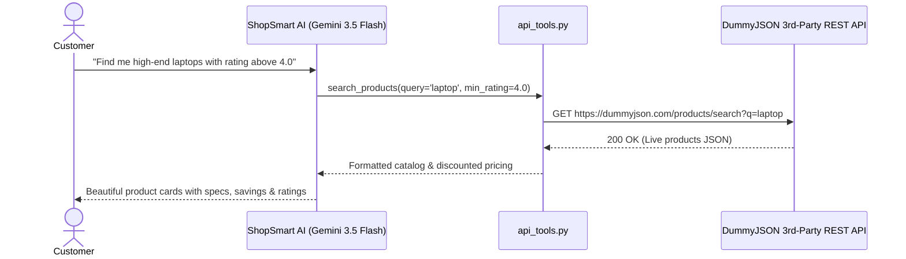

# E-Commerce & Order Assistant (`ecommerce_agent`)

An intelligent AI Customer & Shopping Assistant built with the **Google Agent Development Kit (ADK)** and **Gemini 3.5 Flash**. The agent connects directly to **live 3rd-party e-commerce REST APIs** to search real-time store inventory, compare product specs, find top clearance deals, track shipment orders, and handle returns.

---

## 🏗️ Architecture & 3rd-Party API Flow



---

## 📁 Project Structure

```
ecommerce_agent/
├── api_tools.py                        # 3rd-party REST API integration (Products, Deals, Tracking, RMA)
├── agent.py                            # ADK root_agent definition, instructions, and tools
├── __init__.py                         # Package export
├── .env                                # API keys (Google / Gemini API Key)
└── README.md                           # Documentation and usage guide
```

---

## 🛠️ Key Capabilities & 3rd-Party Tools

1. **`search_products(query, category, min_price, max_price, min_rating, limit)`**:
   - Hits live product endpoints (`https://dummyjson.com/products/search`).
   - Filters by price range, customer ratings, and department categories.
   - Computes live discounted pricing and inventory status.

2. **`get_product_details(product_id)`**:
   - Hits `https://dummyjson.com/products/{id}`.
   - Retrieves full specifications, dimensions, weight, manufacturer warranty, shipping SLA, and real customer reviews.

3. **`list_product_categories()`**:
   - Hits `https://dummyjson.com/products/categories`.
   - Returns all store departments (e.g. `smartphones`, `laptops`, `fragrances`, `beauty`, `groceries`, `sunglasses`).

4. **`get_top_deals(category, min_discount_percent, limit)`**:
   - Analyzes real-time inventory to find products with the highest markdown discounts.

5. **`track_order(order_id)`**:
   - Tracks live shipment status (`Order Placed`, `Packed`, `Shipped / In Transit`, `Out for Delivery`, `Delivered`).
   - Returns carrier info (FedEx, DHL, UPS, BlueDart), tracking numbers, and delivery ETAs.

6. **`request_order_return_or_refund(order_id, reason, action)`**:
   - Initiates an authorized Return Merchandise Authorization (RMA) ticket with return label instructions.

7. **`apply_coupon_and_calculate_cart(items, coupon_code)`**:
   - Calculates itemized subtotals, promo discounts (`SAVE20`, `WELCOME10`, `FREESHIP`), sales taxes, and shipping fees.

---

## 🚀 How to Run

### 1. Interactive CLI Mode
```bash
# Run from parent directory: D:\Projects\ADK demo
adk run ecommerce_agent
```

### 2. Single-Step Query
```bash
adk run ecommerce_agent "Find top deals in laptops with at least 15% discount"
```

### 3. Launch Web UI
```bash
adk web ecommerce_agent
```

### 4. Run via Python Script
```python
import asyncio
from google.adk.runners import Runner
from google.adk.sessions import InMemorySessionService
from google.genai import types
from ecommerce_agent.agent import root_agent

async def main():
    session_service = InMemorySessionService()
    runner = Runner(app_name="ecommerce_agent", agent=root_agent, session_service=session_service)
    session = await session_service.create_session(app_name="ecommerce_agent", user_id="customer_1")
    
    user_query = "What are the top 3 smartphones available, and where is my order ORD-89214?"
    content = types.Content(role="user", parts=[types.Part.from_text(text=user_query)])
    
    async for event in runner.run_async(session_id=session.id, user_id="customer_1", new_message=content):
        if hasattr(event, "content") and event.content:
            for part in event.content.parts:
                if part.text:
                    print(part.text, end="")

if __name__ == "__main__":
    asyncio.run(main())
```

---

## 💬 Sample Demo Queries to Try

| Scenario | Sample Prompt |
| :--- | :--- |
| **Product Search** | *"Search for perfumes under $80 with high ratings."* |
| **Product Specs & Reviews** | *"Give me the full specs and customer reviews for product ID 1."* |
| **Deals & Discounts** | *"Show me the top clearance deals in the store right now."* |
| **Order Tracking** | *"Can you track my shipment with order ID ORD-44912?"* |
| **Returns / Refunds** | *"I want to return order ORD-89214 because the item was defective."* |
| **Cart & Promo Code** | *"Calculate my cart total for a $200 jacket and $50 shoes using coupon SAVE20."* |
