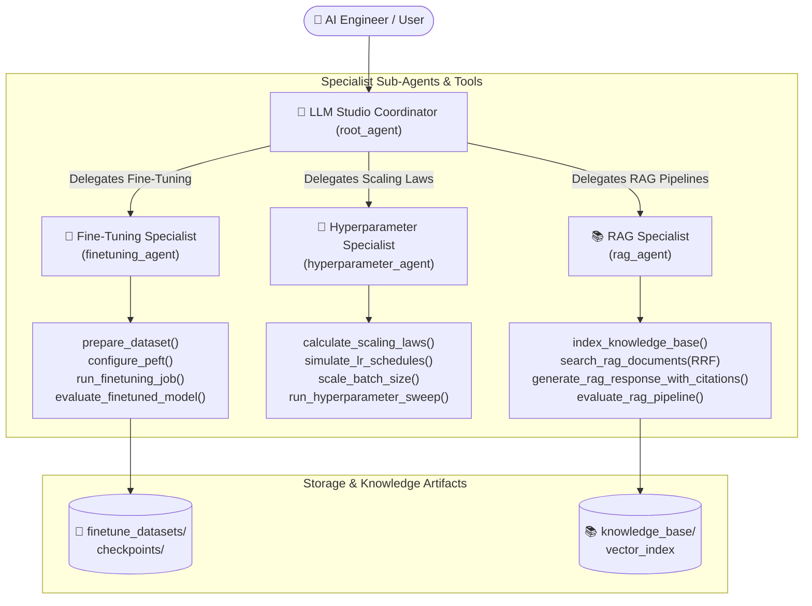

# 🧠 LLM Studio Demo (`llm_demo`)
### *LLM Fine-Tuning, Hyperparameter Scaling Laws & Hybrid RAG Assistant*

An intelligent, multi-agent AI engineering studio built with the **Google Agent Development Kit (ADK)** and **Gemini**. The demo unifies three essential pillars of modern Large Language Model systems:
1. **LLM Fine-Tuning & PEFT**: Dataset curation (SFT), LoRA/QLoRA configuration, parameter & VRAM calculation, training telemetry, and comparative model evaluation.
2. **Hyperparameter Scaling Laws**: Chinchilla compute-optimal frontier ($C \approx 6ND$), learning rate schedules (Cosine Annealing with Warmup), distributed batch size scaling rules, and Bayesian hyperparameter sweeps.
3. **Hybrid RAG (Retrieval-Augmented Generation)**: Semantic/Recursive chunking, Dense Cosine Vector + Sparse BM25 Search with **Reciprocal Rank Fusion (RRF)**, grounded synthesis with strict citations, and RAG Triad quality evaluation (Faithfulness, Relevance, Precision/Recall).

---

## 🏗️ Architecture & Multi-Agent Workflow



---

## 📁 Directory Structure

```
llm_demo/
├── agent.py                      # Root ADK coordinator & specialist sub-agents
├── finetuning_tools.py           # SFT data prep, LoRA/QLoRA config, training & evaluation
├── hyperparameter_tools.py       # Chinchilla scaling laws, LR schedules, batch sizing & sweeps
├── rag_tools.py                  # Hybrid dense/BM25 retrieval, RRF, citation generation & audit
├── run_demo.py                   # Automated & interactive end-to-end demo runner
├── test_demo.py                  # Unit and integration test suite (13 test cases)
├── .env                          # API Key configuration
├── __init__.py                   # Package export of root_agent
├── data/
│   ├── finetune_datasets/        # Generated SFT instruction JSONL datasets
│   ├── checkpoints/              # LoRA adapter config and safetensors checkpoints
│   └── knowledge_base/           # Technical docs for hybrid RAG retrieval
│       ├── llm_fine_tuning_guide.md
│       ├── transformer_scaling_laws.md
│       └── rag_hybrid_retrieval.md
└── README.md                     # Comprehensive documentation and guides
```

---

## 🔬 Pillar 1: LLM Fine-Tuning & PEFT

### Core Tools:
- **`prepare_dataset(task_type, dataset_name, sample_count)`**: Formats instruction tuning (SFT) data in Alpaca JSONL schemas with schema validation and token estimation.
- **`configure_peft(base_model, lora_r, lora_alpha, quantization_bits)`**: Computes low-rank decomposition parameters, trainable parameter percentages (e.g. 0.36%), and VRAM requirements (showing 95%+ memory savings).
- **`run_finetuning_job(job_name, base_model, dataset_name, epochs, batch_size, learning_rate)`**: Runs a training execution tracking loss curves, validation perplexity, sample throughput, and exports adapter configurations.
- **`evaluate_finetuned_model(job_name, test_prompt, compare_with_base)`**: Compares base model output with specialized fine-tuned adapter outputs.

```
+-------------------+----------------+---------------------+-------------------+
| Model             | Base VRAM (GB) | QLoRA 4-bit VRAM(GB)| Memory Reduction  |
+-------------------+----------------+---------------------+-------------------+
| LLaMA 3 (8B)      | 196.7 GB       | 6.37 GB             | ~96.8%            |
| Mistral (7B)      | 177.3 GB       | 5.82 GB             | ~96.7%            |
| Qwen 2.5 (14B)    | 360.2 GB       | 11.24 GB            | ~96.9%            |
+-------------------+----------------+---------------------+-------------------+
```

---

## 📐 Pillar 2: Hyperparameter Scaling Laws

### Core Tools:
- **`calculate_scaling_laws(compute_budget_pflops_days, model_params_b, dataset_tokens_b)`**:
  - Applies Chinchilla Compute-Optimal Frontier ($C \approx 6ND$).
  - Calculates optimal parameters ($N_{\text{opt}} \propto \sqrt{C}$) and optimal tokens ($D_{\text{opt}} \propto \sqrt{C}$).
  - Predicts cross-entropy loss, validation perplexity, and NVIDIA H100 GPU-hours / cluster costs.
- **`simulate_lr_schedules(schedule_type, base_lr, warmup_steps, total_steps)`**:
  - Simulates Cosine Annealing with Warmup, Linear Decay, and OneCycleLR trajectories.
- **`scale_batch_size(base_batch_size, target_batch_size, base_lr, gpu_count)`**:
  - Implements Square-Root and Linear Learning Rate scaling rules for distributed clusters.
  - Computes gradient accumulation steps and execution cadences.
- **`run_hyperparameter_sweep(search_strategy, num_trials)`**:
  - Evaluates parameter combinations (LR, LoRA Rank, Alpha, Weight Decay, Warmup).
  - Determines top trial, Pareto frontier, and parameter importance rankings.

---

## 📚 Pillar 3: Hybrid Retrieval-Augmented Generation (RAG)

### Core Tools:
- **`index_knowledge_base(chunk_strategy, chunk_size, chunk_overlap)`**:
  - Partitions documents via semantic headings or recursive text splitting.
- **`search_rag_documents(query, top_k, retrieval_mode)`**:
  - Combines **Dense Vector Similarity** (cosine semantic match) and **Sparse BM25** (exact keyword matching) using **Reciprocal Rank Fusion (RRF)**:
    $$RRF(d) = \sum_{m \in \{\text{Dense}, \text{Sparse}\}} \frac{1}{60 + r_m(d)}$$
- **`generate_rag_response_with_citations(query, top_k)`**:
  - Synthesizes grounded answers with verifiable in-text citations.
- **`evaluate_rag_pipeline(query, ground_truth)`**:
  - Audits the RAG pipeline using the **RAG Triad** (Faithfulness, Answer Relevance, Context Precision, and Context Recall).

---

## 🚀 How to Run

### 1. Run Automated Walkthrough
```bash
# From workspace root: D:\Projects\ADK demo
python llm_demo/run_demo.py
```

### 2. Run Test Suite
```bash
python llm_demo/test_demo.py
```

### 3. Run with ADK CLI
```bash
# Interactive conversation
adk run llm_demo

# Single query execution
adk run llm_demo "Configure a QLoRA fine-tuning setup for llama-3-8b with rank 16 and estimate memory savings"
```

### 4. Launch ADK Web UI
```bash
adk web llm_demo
```

### 5. Run Programmatically via Python
```python
import asyncio
from google.adk.runners import Runner
from google.adk.sessions import InMemorySessionService
from google.genai import types
from llm_demo.agent import root_agent

async def main():
    session_service = InMemorySessionService()
    runner = Runner(app_name="llm_demo", agent=root_agent, session_service=session_service)
    session = await session_service.create_session(app_name="llm_demo", user_id="engineer_1")
    
    query = "What is the Chinchilla optimal token count for an 8B model and how should I set my cosine warmup schedule?"
    content = types.Content(role="user", parts=[types.Part.from_text(text=query)])
    
    async for event in runner.run_async(user_id="engineer_1", session_id=session.id, new_message=content):
        if hasattr(event, "message") and event.message and event.message.parts:
            for part in event.message.parts:
                if part.text:
                    print(part.text, end="", flush=True)

if __name__ == "__main__":
    asyncio.run(main())
```

---

## 💬 Sample Demo Prompts to Try

| Scenario | Sample Prompt |
| :--- | :--- |
| **LoRA PEFT Sizing** | *"Configure a 4-bit QLoRA setup for llama-3-8b with rank 16 and alpha 32. What are the VRAM savings?"* |
| **Fine-Tuning Job** | *"Prepare a customer support SFT dataset and run a simulated fine-tuning job with 3 epochs."* |
| **Base vs Adapter Eval** | *"Compare base model vs fine-tuned adapter output for error code ERR_PAY_402."* |
| **Chinchilla Compute Laws** | *"What is the compute-optimal model size and token count for 10 PFLOP-days of compute?"* |
| **LR Schedules & Warmup** | *"Simulate a Cosine Annealing with Warmup schedule for 1000 steps with peak LR 3e-4."* |
| **Distributed Batch Scaling** | *"Scale my batch size from 16 to 128 across 4 GPUs using the square-root rule."* |
| **Hyperparameter Sweep** | *"Run a Bayesian hyperparameter sweep over learning rate and LoRA rank to optimize validation loss."* |
| **Hybrid RAG Search** | *"Search the knowledge base using Reciprocal Rank Fusion to explain how LoRA works."* |
| **RAG Grounded Q&A** | *"Answer from docs: What is the empirical rule of thumb for tokens per parameter in Chinchilla scaling?"* |
| **RAG Triad Audit** | *"Run a RAG Triad audit assessing faithfulness and precision for hybrid retrieval."* |
